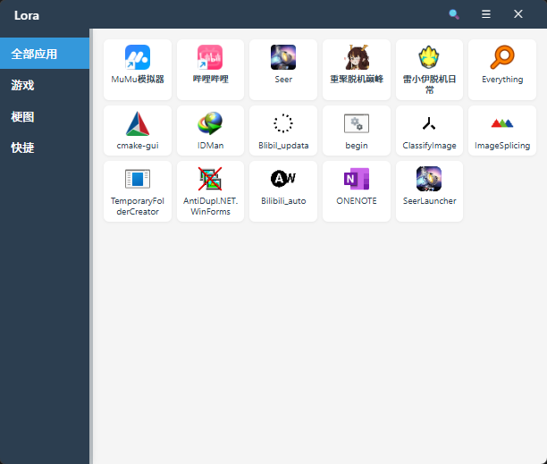

# LORA Organizes & Runs Apps

> [English](./README.md) | [简体中文](./README.zh-CN.md)

> A modern app launcher based on **Tauri + Vue 3**, supporting categorized management and quick launch for efficient desktop workflows.

## 🖼️ Overview

LORA lets you manage, search, and launch Windows programs as easily as mobile apps. Clean UI, smooth operations, and drag-and-drop batch management are supported.

## 🚀 Features

- **Drag & Drop Apps**: Supports multiple executable types, batch drag, and automatic validation.
- **Category Management**: Custom groups, quick move via right-click, rename and delete supported.
- **Quick Launch**: Single/double click, run as admin, more options via right-click.
- **Smart Search**: Real-time search, keyboard shortcut focus.
- **Modern UI**: Custom title bar, responsive design, smooth animations.
- **Lightweight**: Built with Tauri for minimal resource usage and fast startup.
- **Cross-platform**: Currently optimized for Windows with future cross-platform support.

## 🖥️ Screenshots



## 🛠️ Tech Stack

- **Frontend**: Vue 3 + TypeScript + Vite
- **Backend**: Rust + Tauri
- **Style**: CSS3 + Flexbox/Grid
- **Package Manager**: pnpm

## 📦 Installation & Usage

### Requirements

- Node.js >= 18
- Rust >= 1.60
- pnpm >= 8

### Development

```bash
# Clone the repository
git clone https://github.com/JKWTCN/lora.git
cd lora

# Install dependencies
pnpm install

# Run in development mode
pnpm tauri dev
```

### Build

```bash
# Build for production
pnpm tauri build

# The built application will be in src-tauri/target/release/bundle/
```

## 🎯 Usage

### Getting Started

1. **Launch LORA**: Run the application after installation
2. **Add Apps**: Drag executable files (.exe, .bat, etc.) to the main window or right-click to create a new project
3. **Organize**: Create custom categories to organize your applications
4. **Launch**: Single-click or double-click to launch applications

### Advanced Features

- **Batch Operations**: Select multiple apps to move, delete, or modify properties
- **Admin Mode**: Right-click and select "Run as administrator" for elevated privileges
- **Search**: Use Ctrl+F to quickly find applications
- **Custom Icons**: Applications automatically extract their icons for display

## 🔧 Shortcuts

- `Esc`: Hide search box
- `Ctrl+F`: Focus search
- `Enter`: Launch selected application
- `Delete`: Remove selected application (with confirmation)

## 📁 Project Structure

```
lora/
├── src/                 # Vue frontend source code
│   ├── components/      # Vue components
│   ├── assets/          # Static assets
│   └── *.vue, *.ts      # Application files
├── src-tauri/           # Rust backend source code
│   ├── src/             # Rust source files
│   ├── icons/           # Application icons
│   └── tauri.conf.json  # Tauri configuration
├── public/              # Public assets
├── image/               # Screenshots and images
└── *.json, *.md         # Configuration and documentation
```

## 📝 Changelog

### v0.1.6

- 🎉 Latest stable release
- 🔧 Performance optimizations
- 🐞 Bug fixes and stability improvements

### v0.1.5

- ✨ New features added
- 🔧 Performance optimizations
- 🐞 Bug fixes

### v0.1.4

- ✨ Enhanced user interface
- 🔧 Performance optimizations
- 🐞 Bug fixes

### v0.1.3

- ✨ New category management features
- 🔧 Performance optimizations
- 🐞 Bug fixes

### v0.1.2

- 🔧 Minor bug fixes and improvements

### v0.1.1

- 🔧 Performance optimizations
- 🐞 Bug fixes

### v0.1.0

- 🎉 Initial release
- 📁 Basic category management
- 🔍 App search
- 🎨 Modern UI

## 🤝 Contributing

We welcome contributions! Here's how you can help:

1. **Fork the repository**
2. **Create a feature branch**: `git checkout -b feature/amazing-feature`
3. **Commit your changes**: `git commit -m 'Add some amazing feature'`
4. **Push to the branch**: `git push origin feature/amazing-feature`
5. **Open a Pull Request**

### Development Guidelines

- Follow the existing code style and conventions
- Add tests for new features
- Update documentation as needed
- Ensure all tests pass before submitting

## ❓ FAQ

Q: Error on launch or unable to add apps?

A: Make sure Node.js and Rust are up-to-date and run as admin.

Q: How to batch add apps?

A: Drag multiple files to the main window.

Q: Default group can't be deleted?

A: Default group is protected from deletion to avoid accidental data loss.

Q: Can I customize the appearance?

A: Currently, LORA uses a fixed modern theme. Customization options may be added in future versions.

Q: Is data portable?

A: Yes, your app data is stored locally and can be backed up by copying the application data directory.

## 📄 License

MIT License

## 🙏 Acknowledgments

- Thanks to the [Tauri](https://tauri.app/) team for the amazing framework
- Thanks to the [Vue.js](https://vuejs.org/) team for the excellent frontend framework
- Thanks to all contributors who have helped make LORA better
