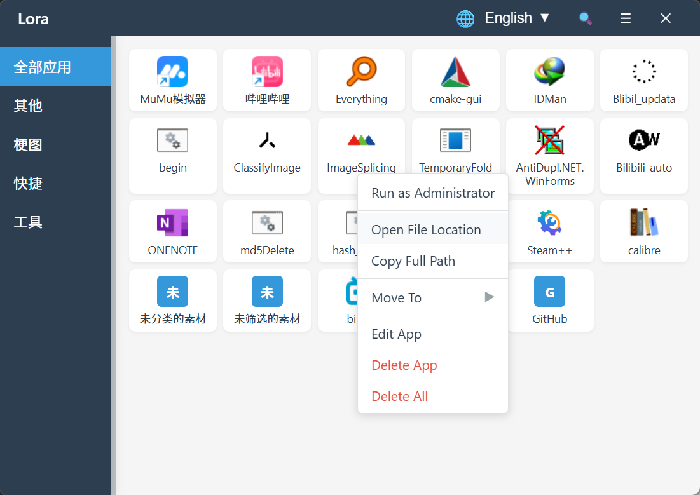

# LORA - Modern App Launcher

<div align="center">


[English](./README.md) | [简体中文](./README.zh-CN.md)

</div>

> **LORA** is a modern, lightweight application launcher built with **Tauri v2** and **Vue 3**. It helps you organize your desktop applications into categories, search them instantly, and launch them with a single click. Designed for efficiency and aesthetics.

## 🖼️ Preview



## ✨ Key Features

- **📂 Drag & Drop Management**: Simply drag `.exe` or `.lnk` files into the window to add them.
- **🗂️ Smart Categorization**: Create custom groups to organize your apps (e.g., "Work", "Games", "Tools").
- **🚀 Quick Launch**: Launch apps instantly. Right-click for "Run as Administrator".
- **🔍 Instant Search**: Press `Ctrl+F` to focus the search bar and find apps by name.
- **🌍 Multi-language Support**: Fully localized in English and Simplified Chinese.
- **💾 Data Backup**: Built-in backup and restore functionality to keep your configuration safe.
- **🎨 Modern UI**: Clean, responsive interface with smooth animations and custom title bar.
- **⚡ Lightweight**: Powered by Rust and Tauri, ensuring minimal resource usage.

## 📥 Download

Download the latest version from the [Releases Page](https://github.com/JKWTCN/lora/releases).

## 🛠️ Tech Stack

- **Frontend**: Vue 3, TypeScript, Vite
- **Backend**: Rust, Tauri v2
- **State Management**: Reactive Vue Store
- **I18n**: vue-i18n
- **Styling**: Native CSS Variables, Flexbox/Grid

## 📦 Development

### Prerequisites

- **Node.js** >= 18
- **pnpm** >= 8
- **Rust** >= 1.70
- **Visual Studio Code** (Recommended) with Tauri + Rust Analyzer extensions

### Setup

1. **Clone the repository**

   ```bash
   git clone https://github.com/JKWTCN/lora.git
   cd lora
   ```
2. **Install dependencies**

   ```bash
   pnpm install
   ```
3. **Run in development mode**

   ```bash
   pnpm tauri dev
   ```

   This will start the Vite dev server and the Tauri application window.

### Build

To build the application for production:

```bash
pnpm tauri build
```

The output installer/executable will be located in `src-tauri/target/release/bundle/`.

## 🎯 Usage Guide

1. **Add Apps**: Drag and drop any executable or shortcut onto the main area.
2. **Edit Info**: Right-click an app card to rename, change icon, or delete.
3. **Manage Categories**: Right-click the sidebar to add, rename, or delete categories.
4. **Settings**: Click the gear icon to access settings (Language, Backup, etc.).

## ⌨️ Shortcuts

| Shortcut     | Action                      |
| ------------ | --------------------------- |
| `Ctrl + F` | Focus Search Bar            |
| `Esc`      | Clear Search / Close Modals |
| `Enter`    | Launch Selected App         |
| `Delete`   | Remove Selected App         |

## 📁 Project Structure

```
lora/
├── src/                 # Frontend (Vue 3)
│   ├── components/      # UI Components
│   ├── i18n/            # Localization files
│   ├── assets/          # Styles and static images
│   └── ...
├── src-tauri/           # Backend (Rust)
│   ├── src/             # Rust source code (Commands, Models)
│   ├── icons/           # App icons
│   └── tauri.conf.json  # Tauri configuration
└── ...
```

## 📄 License

Copyright (c) 2025 JKWTCN. All rights reserved.
