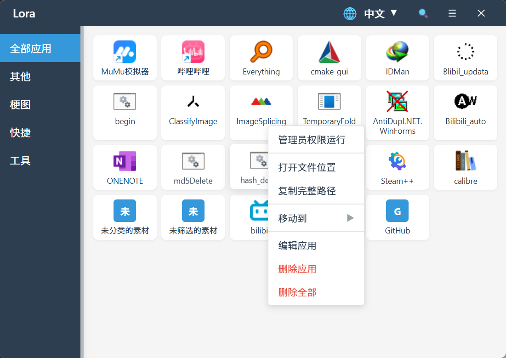

# LORA - 现代化应用启动器

<div align="center">


[English](./README.md) | [简体中文](./README.zh-CN.md)

</div>

> **LORA** 是一款基于 **Tauri v2** 和 **Vue 3** 构建的现代化、轻量级应用启动器。它可以帮助你将桌面应用分类管理，支持即时搜索和一键启动，专为提升效率和美观而设计。

## 🖼️ 预览



## ✨ 核心功能

- **📂 拖拽管理**: 直接将 `.exe` 或 `.lnk` 快捷方式拖入窗口即可添加应用。
- **🗂️ 智能分类**: 创建自定义分组（如“办公”、“游戏”、“工具”）来整理你的应用库。
- **🚀 快速启动**: 单击或双击启动应用。右键菜单支持“以管理员身份运行”。
- **🔍 即时搜索**: 按下 `Ctrl+F` 聚焦搜索框，快速定位应用。
- **🌍 多语言支持**: 内置简体中文和英文界面，可随心切换。
- **💾 数据备份**: 提供数据备份与恢复功能，保障配置安全不丢失。
- **🎨 现代界面**: 简洁响应式设计，流畅动画，自定义标题栏。
- **⚡ 轻量高效**: 基于 Rust 和 Tauri 构建，资源占用极低，启动迅速。

## 📥 下载安装

请前往 [Releases 页面](https://github.com/JKWTCN/lora/releases) 下载最新版本。

## 🛠️ 技术栈

- **前端**: Vue 3, TypeScript, Vite
- **后端**: Rust, Tauri v2
- **状态管理**: Reactive Vue Store
- **国际化**: vue-i18n
- **样式**: Native CSS Variables, Flexbox/Grid

## 📦 开发指南

### 环境要求

- **Node.js** >= 18
- **pnpm** >= 8
- **Rust** >= 1.70
- **Visual Studio Code** (推荐) 配合 Tauri + Rust Analyzer 插件

### 本地运行

1. **克隆仓库**

   ```bash
   git clone https://github.com/JKWTCN/lora.git
   cd lora
   ```
2. **安装依赖**

   ```bash
   pnpm install
   ```
3. **启动开发模式**

   ```bash
   pnpm tauri dev
   ```

   此命令将同时启动 Vite 开发服务器和 Tauri 应用窗口。

### 构建打包

构建生产环境版本：

```bash
pnpm tauri build
```

打包后的安装包/可执行文件将位于 `src-tauri/target/release/bundle/` 目录下。

## 🎯 使用说明

1. **添加应用**: 拖拽任何可执行文件或快捷方式到主界面区域。
2. **编辑信息**: 右键点击应用卡片可进行重命名、更换图标或删除操作。
3. **分类管理**: 右键点击侧边栏可添加、重命名或删除分类。
4. **设置**: 点击右上角齿轮图标进入设置（切换语言、备份数据等）。

## ⌨️ 快捷键

| 快捷键       | 功能                |
| ------------ | ------------------- |
| `Ctrl + F` | 聚焦搜索框          |
| `Esc`      | 清除搜索 / 关闭弹窗 |
| `Enter`    | 启动选中应用        |
| `Delete`   | 删除选中应用        |

## 📁 项目结构

```
lora/
├── src/                 # 前端源码 (Vue 3)
│   ├── components/      # UI 组件
│   ├── i18n/            # 国际化文件
│   ├── assets/          # 样式和静态资源
│   └── ...
├── src-tauri/           # 后端源码 (Rust)
│   ├── src/             # Rust 源代码 (Commands, Models)
│   ├── icons/           # 应用图标
│   └── tauri.conf.json  # Tauri 配置文件
└── ...
```

## 📄 版权说明

Copyright (c) 2025 JKWTCN. All rights reserved.
